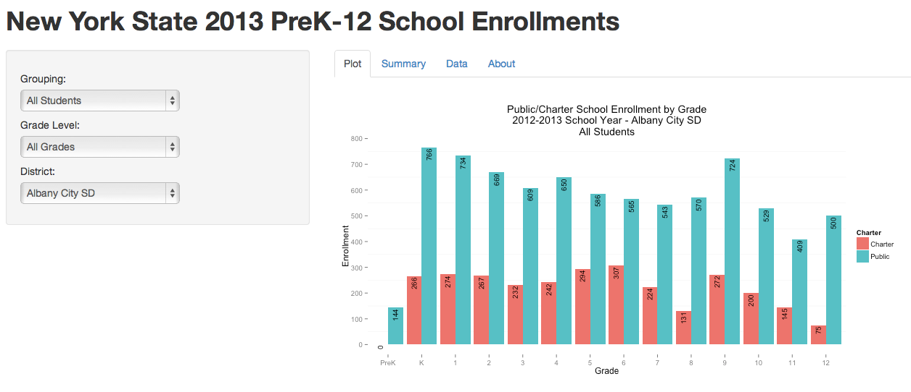
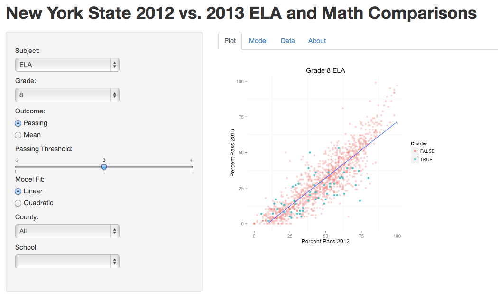

Analysis of New York State Traditional & Charter Public Schools
========================================================

Author: Jason Bryer ([jason@bryer.org](mailto:jason@bryer.org))

This Github repository contains analysis of traditional and charter public schools in New York State.

### Shiny Apps

Shiny is an R package maintained by [RStudio](http://rstudio.com/shiny) that allows for the development of web applications in [R](http://www.r-project.org).

#### New York State 2013 PreK-12 School Enrollments

The purpose of this app is to explore the differences between traditional and charter school attendance (in 2013) for various subgroups. Subgroups include: school district, students with disabilities, economically disadvantaged students. English language learners, race/ethnicity, and gender. Comparisons for all grade levels as well as by elementary, middle, and high school are provided where the enrollment for all schools is provided.

To run this app from Github, type the following command in R:

```
shiny::runGitHub('NYSchools','jbryer',subdir='NYSEnrollment')
```

Or to run a hosted version, go to: [http://rstudio.bryer.org:8080/users/rstudio/NYSEnrollment/](http://rstudio.bryer.org:8080/users/rstudio/NYSEnrollment/). Note that the availability of this app is not guaranteed.




#### New York State 2012 vs. 2013 ELA and Math Comparisons

In 2013 New York administered the first versions of the English Language Arts (ELA) and math assessments to students in grades 3 through 8 aligned with the [Common Core State Standards](http://www.corestandards.org/). The result of this was an almost universal drop in scores and passing rates. Two questions arose from these results: One, were the drops predictable? And two, were the drops between charter and traditional public schools the same? The implications of the latter are that, if charter schools were "teaching to the test" their drops would be greater than predicted. Using data for all public schools in New York, we can explore the relationship between school scores in 2012 (under the old curriculum) and 2013 (under the Common Core State Standards curriculum). 

This app was very much influenced by the [analysis done by Gary Rubinstein](http://garyrubinstein.teachforus.org/2013/08/09/driven-by-data/). However, a few additions were made. On the model tab, the results of a regression model predicting 2013 results from 2012 results is provided (note that you can specify either a linear or quadratic model).

To run this app from Github, type the following command in R (note that this is an approximate 38mb download):

```
shiny::runGitHub('NYSchools','jbryer',subdir='NYSReportCard')
```

Or to run a hosted version, go to: [http://rstudio.bryer.org:8080/users/rstudio/NYSReportCard/](http://rstudio.bryer.org:8080/users/rstudio/NYSReportCard/). Note that the availability of this app is not guaranteed.



### Date Sources
* Directory of schools: http://www.nysed.gov/admin/bedsdata.html (for codes and meta data) and http://www.p12.nysed.gov/irs/schoolDirectory/
* NYS Report Cards: https://reportcards.nysed.gov/databasedownload.php
* 2013 ELA and Math Results: http://www.p12.nysed.gov/irs/pressRelease/20130807/home.html
* Enrollment Data: http://www.p12.nysed.gov/irs/statistics/enroll-n-staff/home.html

