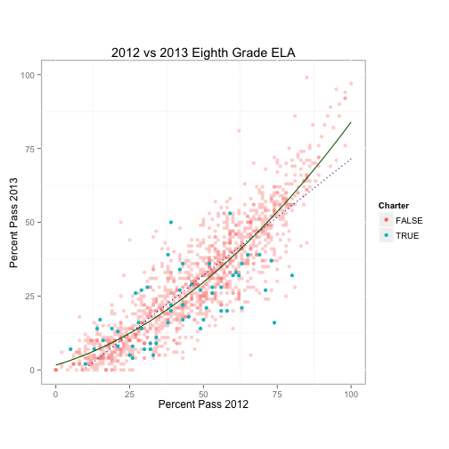
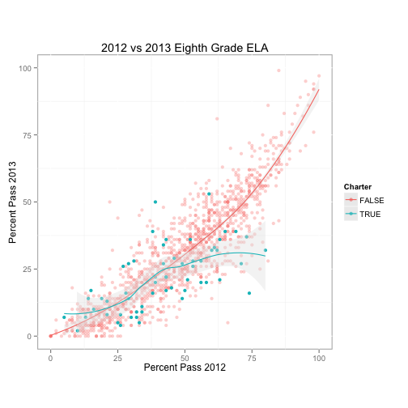

Comparison of 2012 and 2013 ELA and Math Passing Rates for New York State
========================================================

Author: Jason Bryer [jason@bryer.org](mailto:jason@bryer.org)  
Website: [https://github.com/jbryer/NYSchools](https://github.com/jbryer/NYSchools)

In 2013 New York administered the first [Common Core State Standards](http://www.corestandards.org/) aligned English Language Arts (ELA) and math assessments to students in grades 3 through 8. The result of this was an almost universal drop in scores and passing rates. Two questions arose from these results: One, were the drops predictable? And two, were the drops between charter and traditional public schools the same? The implications of the latter are that, if charter schools were "teaching to the test" their drops would be greater than predicted. Using data for all public schools in New York, we can explore the relationship between school scores in 2012 (under the old curriculum) and 2013 (under the Common Core State Standards curriculum). 

[Gary Rubinstein](http://garyrubinstein.teachforus.org/2013/08/09/driven-by-data/) initially analyzed this data and provided scatter plots for seventh grade math. Here we will explore the differences for both math and English Language Arts (ELA) for all grades assessed (grades 3 to 8). I will outline how the analysis was done using the eighth grade ELA results. At the end, a summary table of the results for both subjects across all grades is provided. Additionally, a [Shiny](http://rstudio.com/shiny) application was developed to explore the graphics, statistics, and data for each subject and grade. The source code and instructions for running the application locally is available on [Github](https://github.com/jbryer/NYSchools). You can also [click here](http://spark.rstudio.com/jbryer/NYSReportCard/) to view a hosted version (note that the availability of the application is not guaranteed).

The figure below is a scatter plot showing the passing rates for 2012 on the <i>x</i>-axis and 2013 on the <i>y</i>-axis for each school in New York State. It is quite evident there is a relationship between the two scores. The correlation between the 2012 and 2013 passing rates is 0.8823 and statistically significant (p < 0.001). However, the scatter plot reveals that the relationship is not quite linear. Two regression models are estimated, a linear model represented by the dashed blue line and a quadratic model represented by the solid green line.

 

What we wish to know is whether charter schools performed worse than traditional public schools. From the figure above we can see that many, perhaps even the majority, of charter schools are below the regression lines. One approach to determine whether charter schools had lower passing rates than would be expected is to examine the residuals, or the difference between the predicted values of the regression model and the actual observed value. Since the quadratic model fits the data better (both visually and by a larger R2), we will use the quadratic model here. Note that two tables below provide the results for all grades in math and ELA for both the linear and quadratic models.

<!-- html table generated in R 3.0.3 by xtable 1.7-3 package -->
<!-- Wed Mar 26 17:20:54 2014 -->
<TABLE border=1>
<CAPTION ALIGN="bottom"> Quadratic Regression Results for 7th Grade ELA </CAPTION>
<TR> <TH>  </TH> <TH> Estimate </TH> <TH> Std. Error </TH> <TH> t value </TH> <TH> Pr(&gt;|t|) </TH>  </TR>
  <TR> <TD align="right"> (Intercept) </TD> <TD align="right"> 7.9301 </TD> <TD align="right"> 0.3413 </TD> <TD align="right"> 23.24 </TD> <TD align="right"> 0.0000 </TD> </TR>
  <TR> <TD align="right"> I(Pass2012^2) </TD> <TD align="right"> 0.0084 </TD> <TD align="right"> 0.0001 </TD> <TD align="right"> 91.05 </TD> <TD align="right"> 0.0000 </TD> </TR>
   </TABLE>

The mean residual for charter schools is -3.6295 and -0.5963 for traditional public schools with a difference of 3.0333 (p = 0.0479). Analyzing the residuals can be problematic since they are sensitive to the model fit. However, if the performance of charter and traditional public schools is the same, then the distributions of the residuals should be roughly the same. The tables below show that in most grades, charter schools preformed worse than would be expected. The figure below includes separate Loess regression lines (the grey band is an approximate 95% confidence interval) for charter and traditional public schools. What this shows is that much of the difference lies with those charter schools that scored highest in 2012.

 

<!-- html table generated in R 3.0.3 by xtable 1.7-3 package -->
<!-- Wed Mar 26 17:20:57 2014 -->
<TABLE border=0>
<CAPTION ALIGN="top"> Results of Residual Differences between 2012 and 2013 ELA and Math Passing Rates using Linear Model </CAPTION>
  <tr><td colspan=4 style="border-top:solid 2px #000000"></td><td colspan=2 align="center" style="border-top:solid 2px #000000">Mean of Residuals</td><td colspan=3 style="border-top:solid 2px #000000"></td></tr><tr><td style="border-top:solid 2px #000000; border-bottom:solid 2px #000000">Subject</td><td align="right" style="border-top:solid 2px #000000; border-bottom:solid 2px #000000">Grade</td><td align="right" style="border-top:solid 2px #000000; border-bottom:solid 2px #000000">Correlation</td><td align="right" style="border-top:solid 2px #000000; border-bottom:solid 2px #000000">R2</td><td align="right" style="border-top:solid 2px #000000; border-bottom:solid 2px #000000">Public</td><td align="right" style="border-top:solid 2px #000000; border-bottom:solid 2px #000000">Charter</td><td align="right" colspan=2 style="border-top:solid 2px #000000; border-bottom:solid 2px #000000">Difference</td><td align="right" style="border-top:solid 2px #000000; border-bottom:solid 2px #000000"><i>p</i>-value</td></tr> <TR> <TD> ELA </TD> <TD align="right">   3 </TD> <TD align="right"> 0.80 </TD> <TD align="right"> 0.68 </TD> <TD align="right"> -0.35 </TD> <TD align="right"> -2.15 </TD> <TD align="right"> -1.79 </TD> <TD>  </TD> <TD align="right"> 0.14 </TD> </TR>
  <TR> <TD> ELA </TD> <TD align="right">   4 </TD> <TD align="right"> 0.80 </TD> <TD align="right"> 0.68 </TD> <TD align="right"> -0.59 </TD> <TD align="right"> -3.40 </TD> <TD align="right"> -2.81 </TD> <TD> * </TD> <TD align="right"> 0.02 </TD> </TR>
  <TR> <TD> ELA </TD> <TD align="right">   5 </TD> <TD align="right"> 0.81 </TD> <TD align="right"> 0.70 </TD> <TD align="right"> -0.12 </TD> <TD align="right"> -3.71 </TD> <TD align="right"> -3.60 </TD> <TD> ** </TD> <TD align="right"> 0.00 </TD> </TR>
  <TR> <TD> ELA </TD> <TD align="right">   6 </TD> <TD align="right"> 0.85 </TD> <TD align="right"> 0.79 </TD> <TD align="right"> -0.30 </TD> <TD align="right"> -7.47 </TD> <TD align="right"> -7.18 </TD> <TD> *** </TD> <TD align="right"> 0.00 </TD> </TR>
  <TR> <TD> ELA </TD> <TD align="right">   7 </TD> <TD align="right"> 0.87 </TD> <TD align="right"> 0.82 </TD> <TD align="right"> -0.20 </TD> <TD align="right"> -4.43 </TD> <TD align="right"> -4.23 </TD> <TD> ** </TD> <TD align="right"> 0.00 </TD> </TR>
  <TR> <TD> ELA </TD> <TD align="right">   8 </TD> <TD align="right"> 0.88 </TD> <TD align="right"> 0.85 </TD> <TD align="right"> -0.18 </TD> <TD align="right"> -3.86 </TD> <TD align="right"> -3.67 </TD> <TD> * </TD> <TD align="right"> 0.02 </TD> </TR>
  <TR> <TD> Math </TD> <TD align="right">   3 </TD> <TD align="right"> 0.78 </TD> <TD align="right"> 0.65 </TD> <TD align="right"> -0.46 </TD> <TD align="right"> 0.48 </TD> <TD align="right"> 0.94 </TD> <TD>  </TD> <TD align="right"> 0.53 </TD> </TR>
  <TR> <TD> Math </TD> <TD align="right">   4 </TD> <TD align="right"> 0.77 </TD> <TD align="right"> 0.64 </TD> <TD align="right"> -0.57 </TD> <TD align="right"> -1.92 </TD> <TD align="right"> -1.34 </TD> <TD>  </TD> <TD align="right"> 0.41 </TD> </TR>
  <TR> <TD> Math </TD> <TD align="right">   5 </TD> <TD align="right"> 0.76 </TD> <TD align="right"> 0.61 </TD> <TD align="right"> 0.01 </TD> <TD align="right"> -5.80 </TD> <TD align="right"> -5.81 </TD> <TD> *** </TD> <TD align="right"> 0.00 </TD> </TR>
  <TR> <TD> Math </TD> <TD align="right">   6 </TD> <TD align="right"> 0.76 </TD> <TD align="right"> 0.66 </TD> <TD align="right"> -0.98 </TD> <TD align="right"> -3.44 </TD> <TD align="right"> -2.46 </TD> <TD>  </TD> <TD align="right"> 0.13 </TD> </TR>
  <TR> <TD> Math </TD> <TD align="right">   7 </TD> <TD align="right"> 0.79 </TD> <TD align="right"> 0.69 </TD> <TD align="right"> -0.74 </TD> <TD align="right"> -10.92 </TD> <TD align="right"> -10.18 </TD> <TD> *** </TD> <TD align="right"> 0.00 </TD> </TR>
  <TR> <TD> Math </TD> <TD align="right">   8 </TD> <TD align="right"> 0.78 </TD> <TD align="right"> 0.68 </TD> <TD align="right"> -0.93 </TD> <TD align="right"> -2.63 </TD> <TD align="right"> -1.70 </TD> <TD>  </TD> <TD align="right"> 0.42 </TD> </TR>
   <tr><td colspan=9 style="border-top:solid 2px #000000"></td></tr> </TABLE>

<!-- html table generated in R 3.0.3 by xtable 1.7-3 package -->
<!-- Wed Mar 26 17:20:57 2014 -->
<TABLE border=0>
<CAPTION ALIGN="top"> Results of Residual Differences between 2012 and 2013 ELA and Math Passing Rates using Quadratic Model </CAPTION>
  <tr><td colspan=4 style="border-top:solid 2px #000000"></td><td colspan=2 align="center" style="border-top:solid 2px #000000">Mean of Residuals</td><td colspan=3 style="border-top:solid 2px #000000"></td></tr><tr><td style="border-top:solid 2px #000000; border-bottom:solid 2px #000000">Subject</td><td align="right" style="border-top:solid 2px #000000; border-bottom:solid 2px #000000">Grade</td><td align="right" style="border-top:solid 2px #000000; border-bottom:solid 2px #000000">Correlation</td><td align="right" style="border-top:solid 2px #000000; border-bottom:solid 2px #000000">R2</td><td align="right" style="border-top:solid 2px #000000; border-bottom:solid 2px #000000">Public</td><td align="right" style="border-top:solid 2px #000000; border-bottom:solid 2px #000000">Charter</td><td align="right" colspan=2 style="border-top:solid 2px #000000; border-bottom:solid 2px #000000">Difference</td><td align="right" style="border-top:solid 2px #000000; border-bottom:solid 2px #000000"><i>p</i>-value</td></tr> <TR> <TD> ELA </TD> <TD align="right">   3 </TD> <TD align="right"> 0.80 </TD> <TD align="right"> 0.68 </TD> <TD align="right"> -0.35 </TD> <TD align="right"> -2.15 </TD> <TD align="right"> -1.79 </TD> <TD>  </TD> <TD align="right"> 0.14 </TD> </TR>
  <TR> <TD> ELA </TD> <TD align="right">   4 </TD> <TD align="right"> 0.80 </TD> <TD align="right"> 0.68 </TD> <TD align="right"> -0.59 </TD> <TD align="right"> -3.40 </TD> <TD align="right"> -2.81 </TD> <TD> * </TD> <TD align="right"> 0.02 </TD> </TR>
  <TR> <TD> ELA </TD> <TD align="right">   5 </TD> <TD align="right"> 0.81 </TD> <TD align="right"> 0.70 </TD> <TD align="right"> -0.12 </TD> <TD align="right"> -3.71 </TD> <TD align="right"> -3.60 </TD> <TD> ** </TD> <TD align="right"> 0.00 </TD> </TR>
  <TR> <TD> ELA </TD> <TD align="right">   6 </TD> <TD align="right"> 0.85 </TD> <TD align="right"> 0.79 </TD> <TD align="right"> -0.30 </TD> <TD align="right"> -7.47 </TD> <TD align="right"> -7.18 </TD> <TD> *** </TD> <TD align="right"> 0.00 </TD> </TR>
  <TR> <TD> ELA </TD> <TD align="right">   7 </TD> <TD align="right"> 0.87 </TD> <TD align="right"> 0.82 </TD> <TD align="right"> -0.20 </TD> <TD align="right"> -4.43 </TD> <TD align="right"> -4.23 </TD> <TD> ** </TD> <TD align="right"> 0.00 </TD> </TR>
  <TR> <TD> ELA </TD> <TD align="right">   8 </TD> <TD align="right"> 0.88 </TD> <TD align="right"> 0.85 </TD> <TD align="right"> -0.18 </TD> <TD align="right"> -3.86 </TD> <TD align="right"> -3.67 </TD> <TD> * </TD> <TD align="right"> 0.02 </TD> </TR>
  <TR> <TD> Math </TD> <TD align="right">   3 </TD> <TD align="right"> 0.78 </TD> <TD align="right"> 0.65 </TD> <TD align="right"> -0.46 </TD> <TD align="right"> 0.48 </TD> <TD align="right"> 0.94 </TD> <TD>  </TD> <TD align="right"> 0.53 </TD> </TR>
  <TR> <TD> Math </TD> <TD align="right">   4 </TD> <TD align="right"> 0.77 </TD> <TD align="right"> 0.64 </TD> <TD align="right"> -0.57 </TD> <TD align="right"> -1.92 </TD> <TD align="right"> -1.34 </TD> <TD>  </TD> <TD align="right"> 0.41 </TD> </TR>
  <TR> <TD> Math </TD> <TD align="right">   5 </TD> <TD align="right"> 0.76 </TD> <TD align="right"> 0.61 </TD> <TD align="right"> 0.01 </TD> <TD align="right"> -5.80 </TD> <TD align="right"> -5.81 </TD> <TD> *** </TD> <TD align="right"> 0.00 </TD> </TR>
  <TR> <TD> Math </TD> <TD align="right">   6 </TD> <TD align="right"> 0.76 </TD> <TD align="right"> 0.66 </TD> <TD align="right"> -0.98 </TD> <TD align="right"> -3.44 </TD> <TD align="right"> -2.46 </TD> <TD>  </TD> <TD align="right"> 0.13 </TD> </TR>
  <TR> <TD> Math </TD> <TD align="right">   7 </TD> <TD align="right"> 0.79 </TD> <TD align="right"> 0.69 </TD> <TD align="right"> -0.74 </TD> <TD align="right"> -10.92 </TD> <TD align="right"> -10.18 </TD> <TD> *** </TD> <TD align="right"> 0.00 </TD> </TR>
  <TR> <TD> Math </TD> <TD align="right">   8 </TD> <TD align="right"> 0.78 </TD> <TD align="right"> 0.68 </TD> <TD align="right"> -0.93 </TD> <TD align="right"> -2.63 </TD> <TD align="right"> -1.70 </TD> <TD>  </TD> <TD align="right"> 0.42 </TD> </TR>
   <tr><td colspan=9 style="border-top:solid 2px #000000"></td></tr> </TABLE>

